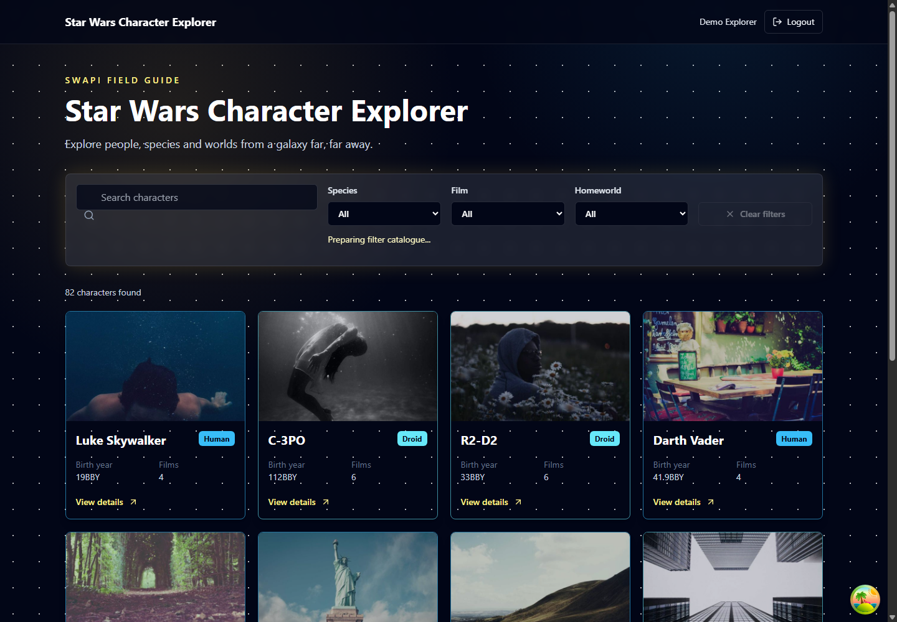
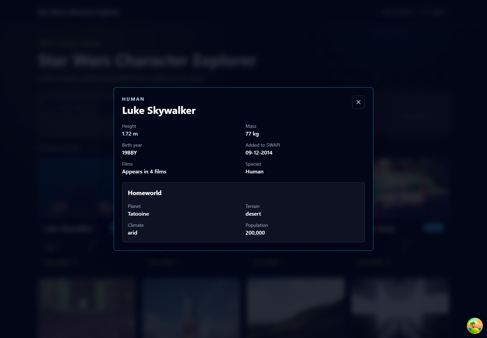
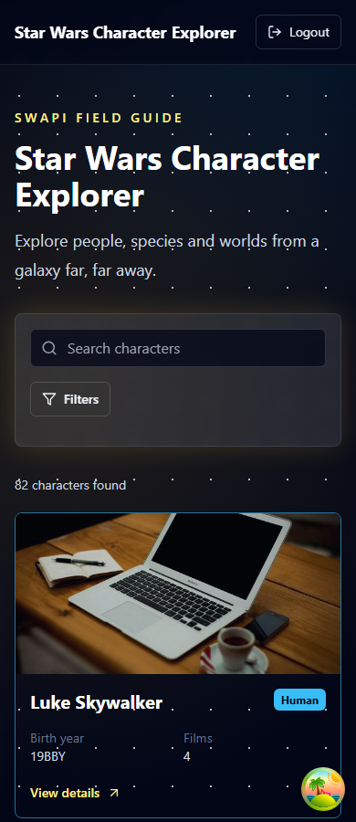
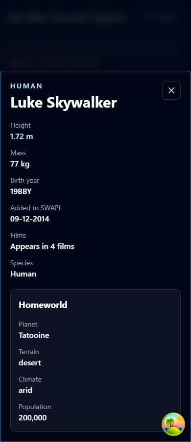

# Star Wars Character Explorer

Live frontend URL: _TBD_  
Backend API URL: _TBD_  
Demo video URL: _TBD_  
GitHub repository URL: _TBD_

## Overview

Production-style MERN + TypeScript take-home project for exploring SWAPI people, species, films, and homeworlds. The app uses a protected React experience, a secure Express auth API, paginated SWAPI loading, animated character cards, detailed modals, search, combined filters, and automated tests.

## Features

- React, TypeScript, Vite, React Router, TanStack Query, Axios, Tailwind CSS, Framer Motion.
- SWAPI `/people/` pagination with URL-backed `page` and `search` params.
- Loading skeletons, refetch indicators, empty states, retryable API errors, and an error boundary.
- Animated keyboard-accessible character cards with session-stable Picsum images.
- Species-aware deterministic card themes with Human fallback.
- Accessible modal with Escape/overlay close, focus trap, focus restore, scroll lock, formatted facts, and independent homeworld loading.
- Brownie-point search, species/film/homeworld filters, active chips, mobile filter drawer, and cached full-catalogue filtering.
- Express backend with MongoDB, Mongoose, bcrypt, JWT access tokens, rotating refresh-token sessions, HTTP-only cookies, Helmet, CORS, rate limiting, Zod validation, and Pino logging.

## Screenshots

Desktop explorer:



Desktop character modal:



Mobile explorer:



Mobile character modal:



To refresh screenshots locally after starting the app:

```powershell
powershell -ExecutionPolicy Bypass -File scripts/capture-screenshots.ps1
```

## Assignment Checklist

### Core Requirements

- [x] React + TypeScript frontend.
- [x] MERN-style backend with Express, MongoDB, and Mongoose.
- [x] Public SWAPI people endpoint integration.
- [x] Supports the assignment API base `https://swapi.info/api`.
- [x] Supports classic paginated SWAPI mirrors.
- [x] Pagination for character browsing.
- [x] Loading state for initial fetches and refetches.
- [x] Error state with retry for network/API failures.
- [x] Character cards display each character name.
- [x] Character cards use random Picsum placeholder images.
- [x] Character cards are colored by species.
- [x] Hover/focus animation on character cards.
- [x] Character card opens a details modal.
- [x] Modal header displays the character name.
- [x] Height is formatted in meters.
- [x] Mass is displayed in kg.
- [x] Added date is formatted as `dd-MM-yyyy`.
- [x] Film count is displayed.
- [x] Birth year is displayed.
- [x] Homeworld name, terrain, climate, and population/residents are displayed.
- [x] Responsive desktop and mobile UI.
- [x] README includes screenshots.

### Brownie Points

- [x] Search by partial or full character name.
- [x] Filter by species.
- [x] Filter by film.
- [x] Filter by homeworld.
- [x] Combined search and filters.
- [x] Mock JWT authentication.
- [x] Silent refresh when access token expires.
- [x] Login and logout UI.
- [x] Integration test verifies the modal opens with the correct person details.

### Code Quality

- [x] Type-safe API parsing with Zod.
- [x] Reusable API clients and query hooks.
- [x] Centralized error normalization.
- [x] Backend validation middleware.
- [x] Secure HTTP-only refresh cookie.
- [x] Token rotation and refresh-session revocation.
- [x] Helmet, CORS, rate limiting, and structured logging.
- [x] Unit, component, integration, and backend API tests.
- [x] Production deployment configs for frontend and backend.

### Submission Items

- [x] Repository folder uses assignment name format: `tsx-mern-05Aug2026`.
- [ ] Push code to GitHub.
- [ ] Add GitHub repository URL above.
- [ ] Deploy frontend to Netlify/Vercel/Cloudflare Pages.
- [ ] Deploy backend to a Node host.
- [ ] Add hosted frontend URL above.
- [ ] Add backend API URL above.
- [ ] Record app and code-flow video.
- [ ] Add video URL above.
- [ ] Submit the assignment form.

## Architecture

The repository is an npm-workspaces monorepo:

```text
tsx-mern-05Aug2026/
├── client/
├── server/
├── docs/screenshots/
├── README.md
├── package.json
├── .gitignore
└── .env.example
```

Frontend code is feature-based under `client/src/features/auth` and `client/src/features/characters`. Presentation components stay separate from query hooks, formatting utilities, SWAPI clients, and catalogue filtering services. Backend code uses controllers, services, schemas, middleware, models, and route modules under `server/src`.

## API Integration

`VITE_SWAPI_BASE_URL` controls SWAPI and defaults locally to `https://swapi.info/api`, the API linked in the assignment. The client also supports classic paginated SWAPI mirrors such as `swapi.dev` and `swapi.py4e.com`. When the API returns `{ count, next, previous, results }`, normal browsing uses API pagination/search. When the API returns a full array, as `swapi.info` does, the client safely applies local search and pagination while preserving the same UI behavior. Related species, homeworld, and film URLs are resolved through reusable cached query functions. When filters are used, the client builds a cached full character catalogue once, resolves unique related resources with a concurrency limit, and applies combined client-side filtering and pagination.

## Authentication

Demo credentials:

```text
Email: demo@starwars.dev
Password: Falcon123!
```

The backend returns a short-lived JWT access token and sets a long-lived refresh token in an HTTP-only cookie scoped to `/api/auth`. The client keeps the access token in memory only. On load, the client silently calls `/api/auth/refresh`; if refresh fails, the protected app redirects to login. Refresh rotates the stored token hash and revokes the previous session. Logout revokes the refresh session and clears the cookie.

## Species Colours And Images

Empty SWAPI species arrays are treated as `Human`. Known species receive hand-picked accessible palettes; other species use a deterministic hash into the palette set. Picsum image URLs use `https://picsum.photos/seed/{safe-character-name}-{session-seed}/600/400`, where the session seed is generated once per browser session.

## Error Handling And Accessibility

Axios errors are normalized into friendly network, timeout, or unexpected-response messages. Development mode may show technical details. The UI avoids clickable `div`s, uses semantic buttons/labels, preserves focus in modals, supports keyboard card activation, prevents background scroll during dialogs, and respects reduced-motion settings.

## Local Setup

1. Install dependencies:

```bash
npm install
```

2. Copy environment files:

```bash
cp .env.example server/.env
cp client/.env.example client/.env
```

3. Start MongoDB locally or set `MONGODB_URI` to MongoDB Atlas.

4. Seed the demo account:

```bash
npm run seed
```

5. Run both apps:

```bash
npm run dev
```

Frontend runs on `http://localhost:5173`; API runs on `http://localhost:5000`.

## Environment Variables

Server: `NODE_ENV`, `PORT`, `CLIENT_URL`, `MONGODB_URI`, `JWT_ACCESS_SECRET`, `JWT_REFRESH_SECRET`, `ACCESS_TOKEN_TTL`, `REFRESH_TOKEN_TTL`, `COOKIE_SECURE`, `DEMO_USER_EMAIL`, `DEMO_USER_PASSWORD`.

Client: `VITE_API_BASE_URL`, `VITE_SWAPI_BASE_URL`.

Never commit real secrets. Use long random JWT secrets in deployed environments.

## Testing

Root commands:

```bash
npm run typecheck
npm run lint
npm run test
npm run build
```

Tests include backend auth and health coverage, frontend formatting/filter utility tests, component tests, protected-route/login tests, and an MSW integration test that opens Luke Skywalker’s modal and verifies formatted character and homeworld data.

## Deployment

Frontend: deploy `client` to Vercel or Netlify. Build command: `npm run build`; output directory: `dist`. `client/vercel.json`, `client/netlify.toml`, and `client/public/_redirects` provide SPA rewrites. Set `VITE_API_BASE_URL` and `VITE_SWAPI_BASE_URL` in the host dashboard. For this assignment, `VITE_SWAPI_BASE_URL=https://swapi.info/api` is the closest match to the provided API link.

Backend: deploy the root repository to Render, Railway, Fly.io, or equivalent Node hosting. Build command: `npm install && npm run build -w server`; start command: `npm run start -w server`; health check: `/api/health`. Use MongoDB Atlas for production and set `COOKIE_SECURE=true`, production `CLIENT_URL`, `MONGODB_URI`, and JWT secrets.

Troubleshooting: verify CORS `CLIENT_URL` exactly matches the deployed frontend origin, cookies are secure over HTTPS, MongoDB Atlas network access allows the host, and SWAPI is reachable from the browser.

## Known Trade-Offs

- SWAPI filtering is client-side only when species, film, or homeworld filters are active because SWAPI exposes those relations as URLs rather than queryable fields.
- Picsum images are intentionally placeholders and not Star Wars artwork.

## Future Improvements

- Add persisted theme preferences.
- Add richer film/species detail panels.
- Add Playwright visual smoke tests for deployed responsive flows.

## Video Walkthrough Checklist

- [ ] Login
- [ ] Character loading
- [ ] Pagination
- [ ] Search
- [ ] Species filter
- [ ] Film filter
- [ ] Homeworld filter
- [ ] Combined search and filters
- [ ] Character card animation
- [ ] Character modal
- [ ] Height, mass, date, films, and birth-year formatting
- [ ] Homeworld data
- [ ] Loading state
- [ ] Error and retry state
- [ ] Responsive mobile view
- [ ] Important frontend folders
- [ ] TanStack Query data flow
- [ ] Authentication and silent refresh
- [ ] Express backend structure
- [ ] Integration test
- [ ] Test and build commands
